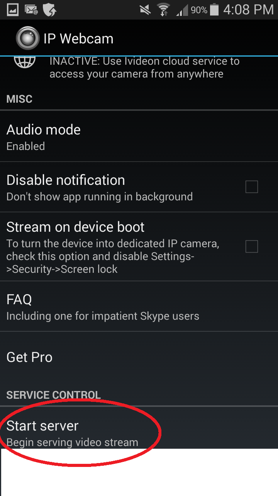
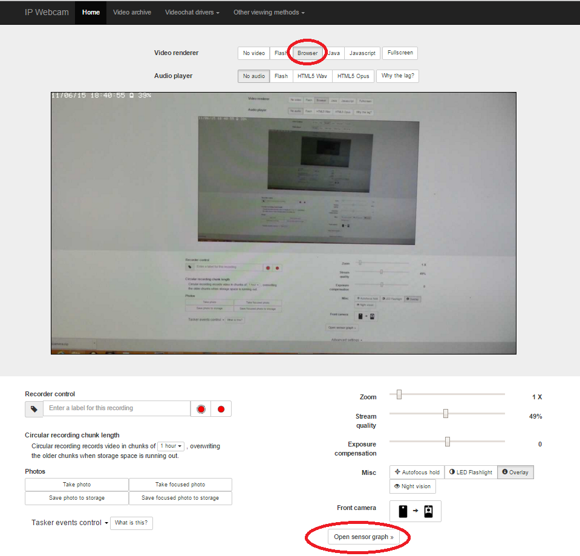

# ip-camera-json-ajax-on-a-webpage
Getting the massive amount of data from the wifi IP Camera for Android onto a web page using AJAX

I said that the cell phone was a great device for getting sensor infomation in my video at 

https://www.youtube.com/edit?o=U&video_id=1ZYcCXPAMPo

and herre is the way to do it 11 months later.

Nov5, 2015
Basically this javascript AJAX page proves you can get individual data from the reams of information colleted by IP camera from all your phones sensors.

Using the amazing wifi IP Camera for Android at 

https://play.google.com/store/apps/details?id=com.pas.webcam&hl=en

This page helps makes the ton of data available to javascript.

And then the App main page on your Android cell phone looks like this

Basic operation is to use the main webpage using the URL gaven to you on the main IP Camera page

example 

http://255.1.1.1:8080       Make sure you are on a wifi network. Not really sure what happens when you are using your cells data.

 and then click on the circled open sensor graph. To see all the data generated by your cell phone.
 
 My Code in this repostory helps you access the data using a webpage.
 

And here is what the web page looks like when it has extracted data from the IP camera.

Note the single gravity X mesurement and then the range of more complex items.

Use at your own risk

By Jeremy Ellis

website at   http://rocksetta.com

Twitter @rocksetta

